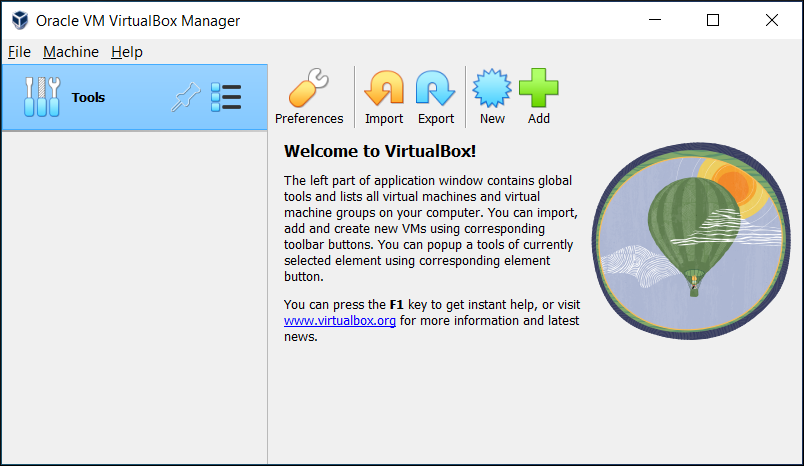

+++
title = "Virtual Machine Setup"
description = "Install and configure Kali Linux in a VirtualBox virtual machine."
+++

To participate in the labs, you will need a functioning virtualization environment. As the majority of people use Windows, we will use VirtualBox as our virtualization software (if you are using Linux, you should already know how to create a virtual machine).

VirtualBox is a free and open-source hosted hypervisor, developed by Oracle Corporation. VirtualBox allows you to run multiple operating systems on a single machine.

## 1. VirtualBox Installation

1. Download the latest version of VirtualBox from the [official website](https://www.virtualbox.org/wiki/Downloads).
2. Run the installer and follow the instructions.

You should then be able to open VirtualBox and get a screen similar to the one below:

## 2. Kali Linux Installation

We will use Kali Linux as our main operating system for the labs. You can download the latest version of Kali Linux from the [official website](https://www.kali.org/downloads/).

1. Go to the [official website](https://www.kali.org/downloads/) and click on the "Virtual Machines" button.
2. Click on the "VirtualBox" button. The download should start automatically.
3. Once the download is complete, extract the files to a folder of your choice.
4. Double click on the `.vbox` file to open it in VirtualBox.

You should now have a Kali Linux virtual machine running in VirtualBox.

## Troubleshooting

If you encounter any issues during the installation process, please refer to the [official VirtualBox documentation](https://www.virtualbox.org/wiki/Documentation).

If you are still having trouble, feel free to ask for help in the Telegram chat or directly during the meetings.
